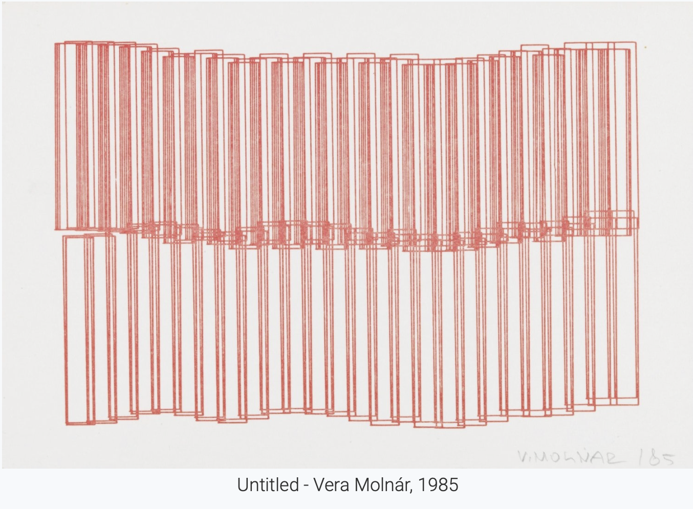

# Module Journal - Generative Computer Graphics

## 16-09-2025 - Week 01

### Introduction & Foundations

- How did analog rules compare to coding rules?
  - analogue rules: Done physicaly by hand therfore it's imperfect but organic, it's time consuming, not really flexibal (Hard to change once started), when there is randomness it's mostly by acident, it has texture and "personality" because the rules lived in the artist hands
  - coding rules: Executed digitally by algorithms, precise until you add randomness, Easy to tweak parameters or generate variations instantly, feels calculated/ clean -> no personality, because even the randomness is calculated at some point

- Where did ambiguity or randomness lead to surprising results?
  - it brings unique visual effects
    > "When you write a program, it’s going to be executed the same way every single time. So if you define a system like this where things can happen at random, as the creator, you can be surprised by your own program, which is really great." - Jared Tarbell
    
- Which historical examples inspired you?
  - untiteld, Vera Molnár, 1985

    
    
  - Substrate - Jared Tarbell, 2003
    
    
    
- What was difficult about setting up your environment?
  - i had issues with github pages because i wanted to do it from scratch to get familiar with the envroment because i'm sure that is something that is important in the future
  
## 23-09-2025 - Week 02

### Grids & Patterns

- How did your initial paper sketches influence your digital pattern? Did anything change in translation?
  - I use the sketche as guidance and motivation to stay focused on the goal I had in mind at the beginning. Can be frustrating when I set the goals to high which don't add to my knowledge yet.
- What strategies did you use to balance order and randomness in your grid or pattern?
  - 
- Describe a moment when a mistake or unexpected result led to a new idea or direction.
  - 
- How did you approach making your pattern “infinite” or seamlessly tileable? What challenges did you face?
- How did working with code change your perception of artistic control compared to analog methods?
- What did you learn about the relationship between simple rules and complex outcomes?


<iframe src="https://editor.p5js.org/saraimmtech/full/4rfxuTqXl" width="100%" height="450" frameborder="no"></iframe>

  
## 30-09-2025 - Week 03

### Grids & Patterns

- Setting Up GitHub Pages
- Working on Grids


<iframe src="https://editor.p5js.org/saraimmtech/full/yL7A0Io8S" width="100%" height="450" frameborder="no"></iframe> 


<iframe src="https://editor.p5js.org/saraimmtech/full/gHh0xZ56N" width="100%" height="450" frameborder="no"></iframe> 

## 07-10-2025 - Week 04

# Clock

How does your clock represent time differently from a real one?
- How it represents time differently:
Unlike a normal clock with fixed hands moving around a face, this design uses colored arcs that grow and shrink over time. Instead of hands rotating, each ring fills up as seconds, minutes, and hours pass — so time feels like expanding waves rather than ticking motion. The pulsing center and soft transitions make it feel alive and continuous instead of mechanical.

What does cyclical vs linear mean in your design?
- Cyclical vs linear meaning:
The design is cyclical because time loops visually — when seconds, minutes, or hours reset, their arcs start over smoothly, showing the repeating rhythm of time. There’s no straight path or endpoint. A linear design would show time as a timeline or progress bar moving in one direction. Here, everything circles back, symbolizing time as an ongoing cycle rather than a straight line.


<iframe src="https://editor.p5js.org/saraimmtech/full/Acucskcub" width="100%" height="450" frameborder="no"></iframe> 

This code uses the current computer time to draw animated, circular arcs that represent hours, minutes, and seconds.

- setup() makes a pink canvas and sets drawing modes (center alignment, degrees for angles).
- draw() runs every frame, updates the clock, and redraws everything.
  - It gets the current hour, minute, and second using p5.js time functions.
  - The translate(width/2, height/2) moves the origin to the canvas center.
  - Then three concentric arcs show time progress:
    - Outer arc → seconds (thin red line)
    - Middle arc → minutes (blue line)
    - Inner arc → hours (greenish line)
  - The arcs sweep clockwise using map() to convert time values to angles.
  - A small dark pulsing circle in the center represents milliseconds (beats once per second).
  - Digital time is displayed below the arcs in white text with AM/PM formatting.
  - Below that, the date (day/month/year) is shown subtly.
- mousePressed() saves the canvas as a PNG snapshot when you click.

# Circle-Drawing tool


<iframe src="https://editor.p5js.org/saraimmtech/full/yo2mJqUoO" width="100%" height="450" frameborder="no"></iframe> 

This sketch makes a simple generative circle-drawing tool. Every time you click, it drops a randomly sized, randomly colored circle at the mouse position.

**How it works:**
- *circles* stores all created circles as *objects {x, y, r, color}*.
- *DEFAULT_RADIUS* is a base size that gets scaled randomly when you click.
- *setup()* makes a white canvas, turns off strokes so circles look clean.
- *draw()* loops through the *circles* array each frame and draws every one — that’s why older circles stay visible.
  - *mousePressed()* adds a new circle with:
  - random radius (20–120% of default)
  - random color with slight transparency (so overlaps blend nicely)
  - position where you clicked
    
**Summary:**
Each click adds a new circle, building up a layered field of colors — a simple interactive generative composition where randomness and repetition create the pattern.

# Etch A Sketch


<iframe src="https://editor.p5js.org/saraimmtech/full/-WTDxlDWW" width="100%" height="450" frameborder="no"></iframe> 

This is an Etch A Sketch-style sketch built with p5.js. It uses an offscreen buffer as the “screen” that keeps the etched lines persistent while the main canvas draws the frame and controls.

**Top-level data**
- *buffer* — *createGraphics(...)* offscreen canvas where all drawn lines go (so lines persist and can be cleared separately).
- *stylus* / *prevStylus* — current and previous pen positions inside the buffer.
- *leftKnob*, *rightKnob* — two Knob objects representing the physical knobs; left controls horizontal, right vertical.
- *lastAngles* — stores previous knob angles so movement is computed from angle differences.
- *speedFactor* — scales how much knob rotation translates to stylus movement (higher = faster pointer).
  
**Knob object**
- *Knob(x,y,r,orientation)* stores position, radius, visual *angle*, *grabbed* state and *orientation* (stored but not functionally used in this code).
- *draw()* — draws a round knob with a small indicator line rotated by *angle*.
- *hitTest(mx,my)* — checks if mouse is inside the knob circle.
  
**Setup**
- Canvas and buffer created, buffer cleared with *resetBuffer()*.
- Stylus starts centered in the buffer.
- Knobs positioned at bottom left / bottom right. *angleMode(RADIANS)* is used.
  
**Draw loop**
- Draws the red Etch A Sketch frame and places the *buffer* image inside it (translated by *translate(40,40)*).
- Draws a tiny indicator for current stylus position on top of the buffer.
- Draws knob UI and labels.
- Calls *applyKnobMovement()* every frame to convert knob rotations to movement on the buffer.
- Handles *shaking* animation: small horizontal wobble, then clears *buffer* after ~30 frames.
  
**applyKnobMovement() — the important mapping**
- Computes angle deltas: *dA_left = leftKnob.angle - lastAngles.left*, same for right.
- Updates *lastAngles* to current angles.
- Converts deltas to pixel movement:
  - *dx = dA_left * (speedFactor * 60)*
  - *dy = dA_right * (speedFactor * 60)*
    (so small angle changes move the stylus; 60 is an arbitrary scale factor)
- Moves *stylus* by *dx, dy*, constraining it inside the buffer bounds.
- Draws a line on *buffer* from *prevStylus* to *stylus* so the path is etched.
  
**User interactions**
- *mousePressed()* sets *grabbed* for a knob if clicked; stores *lastMouseAngle* (used to make dragging feel relative).
- *mouseDragged()* updates the grabbed knob’s *angle* using *atan2(mouseY - knob.y, mouseX - knob.x)* so turning the mouse around a knob rotates it.
- *mouseReleased()* drops knobs.
- *keyPressed()* provides keyboard control: arrow/WASD rotate the left/right knobs; spacebar triggers *startShake()* to clear.
- *startShake()* starts the shake animation and eventually calls *resetBuffer()* to wipe the drawing.
  
**Other small details**
- *resetBuffer()* fills the buffer with a gray background (clears the drawing).
- Stroke caps/joins set for smoother lines.
- *orientation* on the *Knob* is present but not used — both knobs affect movement via their angles (the left maps to *dx*, the right to *dy*).
- Angles are in radians; movement comes from change in angle, not absolute angle.

**Summary (one-liner)**
It simulates an Etch A Sketch by converting knob rotation deltas into x/y stylus movement that draws persistent lines on an offscreen buffer; knobs are interactive with mouse + keyboard, and shaking clears the buffer.

## Project Idea

### Mind Garden

**Concept**

An interactive visualization of emotions. Users type one word describing how they feel, and the system grows a visual form based on its semantic meaning — e.g., “calm” creates smooth blue waves, “angry” triggers red spikes and chaotic movement.

**Interaction**
- Text input = seed word
- Algorithm translates sentiment → color, form, and motion rules
- Over time, the canvas becomes a garden of emotions from the users

**Why?**

It’s interactive and personal — visualizing emotions is always fascinating, as the outcomes can be surprising and unique each time. I can also imagine this being a fun and creative tool for psychologists to include on their websites, allowing visitors to express their feelings and receive engaging visual feedback.

