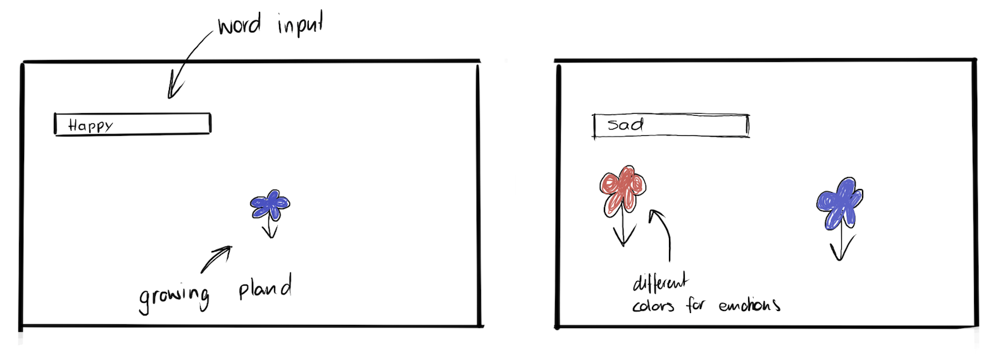
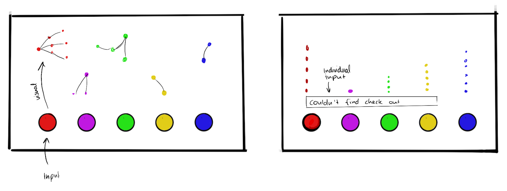

# Module Journal - Generative Computer Graphics

Coming from a background in carpentry, where my job description was basically "build it with your bare hands," using code as a creative tool has challenged me in ways I didn't see coming. This journal is a space for me to document the whole journey—the mistakes, the "aha!" moments, the total failures, and the wins. It’s a look at how my creative process is shifting from the analog world to an algorithmic one.

## Lesson 01 - Introduction & Foundations

In our first lecture, we dove into Generative Computer Graphics by playing a game called Sprouts. We started with a few random dots on paper, then took turns connecting them with lines and adding a new dot in the middle of every connection. We kept going until we were totally stuck. You can see our result below.


Honestly, we might have messed up the rules a bit, but we ended up with this random sketch that started as dots and finished looking like... a peach? A cockatoo? We aren't really sure, but we had a blast making it.

It reminded me of something Jared Tarbell said: "When you write a program, it’s going to be executed the same way every single time. So if you define a system like this where things can happen at random, as the creator, you can be surprised by your own program, which is really great."

That’s exactly why I picked one of his pieces to feature here; it's that element of randomness that makes the visuals feel unique.


I’ve always been fascinated by art that begins with one simple piece and, through nothing but repetition and a few rules, grows into something incredibly complex and complete.
  
## Lesson 02 - Grids & Iterative Patterns - Structured generative systems

My first attempt was inspired by a chessboard, using a simple function to build a grid of 8 columns and 8 rows. This served as the foundation for the logic I’d use later on.

 <iframe src="https://editor.p5js.org/trisaratops2.0/full/gHh0xZ56N" width="100%" height="450" frameborder="no"></iframe> 

The code calculates a `cellSize` by dividing the workspace into 8 columns and 8 rows. Using "nested loops" (a loop inside a loop), it systematically moves across every single "plot" on the grid, just like you’d mark out a piece of timber for repeatable cuts.

The line `if((i + j) % 2 == 0)` acts as a filter. It uses a bit of math to check if a cell is "even" or "odd." This ensures the code only draws on every other square, creating that alternating checkerboard pattern automatically rather than you having to pick each spot by hand.

This is a vital concept in creative coding.
- `push()`saves the current state of the canvas.
- `translate()` and `rotate()` move the "tools" to the center of a specific square.
- `pop()`resets everything back to the original corner. It’s exactly like using a jig in woodworking: you set it up to do one specific task in one specific spot, then remove it so you can move on to the next piece without your previous measurements interfering.

Instead of a static image, the code uses`frameCount` and `angle`.

- `frameCount` acts like a clock that never stops, causing the lines to spin.
- Adding `(i + j)` to the angle ensures that not every line spins at the exact same time. This creates a "staggered" or wave-like motion across the grid, adding that layer of complexity you mentioned admiring in Jared Tarbell’s work.

Building on what I learned in the first lesson, the next sketch takes the idea of a simple grid and makes it feel alive. It’s less about a static image and more about creating a "system" that moves on its own.

 <iframe src="https://editor.p5js.org/trisaratops2.0/full/yL7A0Io8S" width="100%" height="450" frameborder="no"></iframe> 

Just like the first experiment, this starts with a 10x10 grid. The code calculates a`centerX` and `centerY` for every single cell. This is important because it gives each square its own "anchor point." By defining these centers first, I can move, spin, or scale each square individually without them drifting out of their lane. It keeps the chaos organized.

Instead of just drawing squares, I’m using a `sin()` wave combined with the`frameCount` to control their size.
- The `map()` function translates that mathematical wave into a `scaleFactor`, making the squares grow and shrink between 80% and 120% of their original size.
- By adding `(x + y)` to the math, the squares don't pulse all at once. It creates a ripple effect that travels diagonally across the screen. It’s a perfect example of how adding one tiny variable to a simple rule can make a rigid grid feel organic and fluid.

After experimenting with rotating lines and pulsing squares, I wanted to combine the two ideas into turning tiles. In the process, I stumbled onto something pretty interesting.

 <iframe src="https://editor.p5js.org/trisaratops2.0/full/VInFjYFkg" width="100%" height="450" frameborder="no"></iframe> 

It’s hard to miss that the tiles are turning at different speeds. This happened because of how I set up the rotation math:

`let angle = frameCount * 0.01 * (x + y);`

Because the value of `x + y` is different for every single tile, the speed changes depending on where the tile is located. The tiles in the top-left rotate slowly, while the ones in the bottom-right spin much faster. This was one of those great moments where an unexpected result—basically a "mistake"—led to a completely new idea.

In the first canvas, I mostly played around with shapes and different ways to make things turn. In the second version, I experimented with color. It’s fascinating how such a small change in color can completely shift the mood of the piece. While the first one feels more mechanical, the second one feels like a floating simulation.

 <iframe src="https://editor.p5js.org/trisaratops2.0/full/4rfxuTqXl" width="100%" height="450" frameborder="no"></iframe> 

Since the `draw()` function refreshes about 60 times per second, the sketch is constantly unfolding. I noticed there’s a specific moment where all the tiles seem to align and turn together—it almost looks like a wave catching the sun or a mirror reflecting light, even though the colors aren't actually changing. It’s that element of surprise in the code that Jared Tarbell talked about.

## Lesson 03 - Clock / Time - Generative representation of time

In today’s lesson we were building a device visualizing the passing of time. To have an idea how I want to build my clock I drew a quick sketch to define the key elements of the goal I wanted to achieve

Unlike a normal clock with fixed hands moving around a face, this design uses colored arcs that grow and shrink over time. Instead of hands rotating, each ring fills up as seconds, minutes, and hours pass — so time feels like expanding waves rather than ticking motion. The pulsing center and soft transitions make it feel alive and continuous instead of mechanical.

 <iframe src="https://editor.p5js.org/trisaratops2.0/full/Acucskcub" width="100%" height="450" frameborder="no"></iframe> 

The most important part of this code is the `map()` function. Since time naturally comes in segments—60 seconds, 60 minutes, 12 hours—I had to find a way to translate those numbers into degrees to get the arcs to draw themselves around a circle.
I set it up so that as the time increases, the arc grows from -90 degrees (the top of the circle) all the way to 270 degrees. To make the movement feel fluid rather than jumpy, I added a bit of extra math, like `mn + sc / 60.0`. This ensures the minute hand doesn’t just snap to the next position every minute; instead, it creeps forward slightly with every second, making the system feel much more organic. To top it off, I used `millis()`to create a center pulse—a tiny "heartbeat" that keeps the sketch moving even when the hour hand seems still.

### Only a Second

I’ve always been fascinated by how much actually happens in the world every single second, and I wanted to try and capture that scale within my clock. I used the website everysecond.io as a reference—it visualizes things like a whale’s heartbeat, Apple’s marketing spend, or the sheer amount of plastic entering the ocean.
The count starts the moment the page is refreshed. Since I’m also studying UI and UX, I have to admit it’s a bit of a "fail" on my part that I forgot to include a text display showing how many minutes have actually passed. In this system, one full 360-degree rotation equals one minute, and the data counts up second by second.

 <iframe src="https://editor.p5js.org/trisaratops2.0/full/vN-LeUx2A" width="100%" height="200" frameborder="no"></iframe> 

The 60-Second Cycle A full 360∘ turn in p5.js is represented as `TWO_PI`. To ensure the needle completes this turn in exactly 60 seconds, the rotation is defined by the ratio of time passed against the target duration:

- `millis() / 1000`: Converts the internal clock to raw seconds.
- `/ 60`: Determines the "percentage" of the minute that has completed.
- `* TWO_PI`: Maps that percentage to the circle.

Every cell in the grid references the exact same `angle` variable. This creates a unified mechanical movement —acting as a single, distributed clock face.
The data visualization follows the same temporal logic. Since `runningTotal` uses the same `secondsElapsed` variable as the rotation, the numbers and the needles are perfectly tethered. As the needle completes its 60-second circuit, the numbers climb at the exact calibrated `rate` defined in the `stats` array.
Easy said: A visual rotation and data accumulation are locked to the same 1:1 real-world second.

## Lesson 04 - Drawing Machines - Generative systems as drawing tools

Instead of directly controlling every line, you define the logic and let the system execute it.

### Circle-Drawing tool

Each click adds a new circle, building up a layered field of colors — a simple interactive generative composition where randomness and repetition create the pattern.

 <iframe src="https://editor.p5js.org/trisaratops2.0/full/yo2mJqUoO" width="100%" height="450" frameborder="no"></iframe> 

Unlike my previous sketches where things were drawn and then refreshed every frame, this one uses an empty "container" (an array) to store every circle I create. By pushing new data into this list every time I click, the code "remembers" every single circle’s position, size, and color. In the `draw()` loop, it constantly cycles through that list to redraw the entire collection, allowing the image to build up over time rather than just disappearing.

Even though I’m the one choosing where the circles go, I’ve left some of the decisions up to the code.

-	Every time I click, the code takes my `DEFAULT_RADIUS`and multiplies it by a random number between 0.2 and 1.2. This gives the "stamps" some organic variety.
-	I set the colors to pull from a random range of RGB values with a bit of transparency (200).
  
It’s a mix of my own intent—clicking exactly where I want—and the computer’s ability to add those "surprises".

### Etch A Sketch

I can't really say why or how, but while developing the circle drawing tool, I was reminded of another drawing tool. I couldn't remember what it was called, just the feeling of using it. I drew a quick sketch in Procreate, hoping someone would recognize it.


Finally, someone did: it was an Etch A Sketch. The toy was invented in the late 1950s by a French electrician. The idea came to him by watching pencil strokes being transferred through plastic sheets on a factory wall. Inside the glass screen is a thin layer of aluminum powder. When the knobs are turned, a hidden pointer (pen) moves across the surface and scratches away the powder. This process leaves dark lines where the powder has been removed.

 <iframe src="https://editor.p5js.org/trisaratops2.0/full/-WTDxlDWW" width="100%" height="600" frameborder="no"></iframe> 

This sketch is an Etch A Sketch–inspired drawing tool built with p5.js. It uses an offscreen buffer as the “screen,” which allows the etched lines to remain while the main canvas continuously redraws the frame and interface elements. The drawing can be controlled either by interacting with the knobs using the mouse, or through the keyboard: W and S move the stylus up and down, while A and D move it left and right.

**Offscreen Drawing Buffer**

`let buffer; `

The buffer functions as the Etch A Sketch screen. Because all drawing happens there, the frame and controls can be redrawn every frame without affecting the marks that have already been made. This separation helps the drawing behave more like a physical surface than a typical digital canvas.

**Stylus State**

`let stylus; `

`let prevStylus; `

The stylus represents the current position of the hidden drawing mechanism. It is not a visible pen, but an abstract point that moves across the buffer. Each frame, the previous position is stored, a new position is calculated, and a line is drawn between the two. This produces continuous strokes rather than discrete points, reinforcing the feeling of a mechanical plotting process.

**Button object: Rotary encoder as control signal**

`function Knob(x, y, r, orientation) `

Each knob is defined as a small object with a position, a radius, a rotation angle, and a grab state to track interaction. The knobs do not move the stylus directly. Instead, changes in their rotation are interpreted as movement signals, which are later translated into drawing.

**Visual Representation**

```js
Knob.prototype.draw = function() {
  rotate(this.angle);
  ellipse(0, 0, this.r*2);
  line(0, -this.r*0.5, 0, -this.r*0.9);
};
```

A simple line indicator shows the current orientation of each knob. This makes the rotation legible without the need for numerical values or additional interface elements.

**Interaction Logic**

`Knob.prototype.hitTest = function(mx, my) `

The knobs can be grabbed using distance-based hit detection. Once grabbed, their angle is updated using:

`atan2(mouseY - knob.y, mouseX - knob.x) `

This converts circular mouse movement into rotation, preserving an intuitive and physically familiar interaction.

**Translating Rotation into Drawing**

The most important conceptual step takes place in `applyKnobMovement()`:

`let dA_left  = leftKnob.angle  - lastAngles.left; `

`let dA_right = rightKnob.angle - lastAngles.right;`

Instead of using absolute angles, the sketch measures how much each knob has rotated since the last frame. These angular changes are then converted into linear movement:

`let dx = dA_left  * (speedFactor * 60); `

`let dy = dA_right * (speedFactor * 60); `

This approach avoids sudden jumps, encourages slow and continuous interaction, and introduces a sense of inertia similar to physical mechanisms. The stylus is constrained to the boundaries of the buffer, preserving the edges of the drawing surface.

**Drawing as Accumulation**

`buffer.line(prevStylus.x, prevStylus.y, stylus.x, stylus.y); `

Each frame leaves behind a permanent mark. There is no undo, and no way to correct a line once it has been drawn. This creates a subtle pressure toward patience and intentionality, echoing the constraints of analog drawing tools.

**Frame and Interface Design**

The red frame surrounding the drawing area is purely graphical, but it plays an important role in how the sketch is perceived. It frames the interaction as an object or device rather than an open canvas:

`rect(0, 0, width, height, 28); `

`text('ETCH A SKETCH', width/2, 28); `

This reinforces the metaphor and invites a more playful, exploratory approach to drawing.

**Reflection**

This sketch shows how relatively simple relationships—angular change, linear mapping, and constraint—can produce rich generative behavior when paired with a strong interaction metaphor. The drawing emerges over time through use, rather than through direct control, positioning the system somewhere between a drawing tool and a generative machine.

## Lesson 06 - Faces / Parametric Generators - Parametric design through faces

To be honest, I’ve never really been a fan of portraits, so focusing on faces wasn't exactly my favorite topic. Whether it’s a detailed sketch or something abstract made of shapes, it just never clicked with me the way geometric systems do. Because of that, I’m keeping this chapter short.

My first attend was rather simple its is a simple face created like a little child is told to draw a face. It looks like a tomato with a few hair and a face.

 <iframe src="https://editor.p5js.org/trisaratops2.0/full/67_o7XVZZ" width="100%" height="450" frameborder="no"></iframe> 

At the top of the code, I defined a set of "blueprint" variables like `eyeSize`,  `irisSize`, and `eyeSpacing`. By doing this instead of just hard-coding numbers, I’ve created a system where I can change the entire character of the face just by tweaking a few values. It’s like having a master control panel for the face’s proportions. For example, if I change the `eyeSpacing`, both eyes move together, maintaining their symmetry automatically.

For the hair, I went back to the `for`loop logic I used in my grids. Instead of drawing every strand by hand, I wrote a loop that repeats a `bezier()` curve ten times. A bezier curve is basically a line that "bends" between two points—it’s much more fluid and natural-looking than a straight line, which is perfect for representing hair.

The next sketch takes the "digital anatomy" idea a step further by introducing Generative Design. Instead of me manually tweaking the values to change the face, I’ve built a system that does it for me at the click of a button. It’s all about creating a set of rules and then letting the computer "roll the dice."

 <iframe src="https://editor.p5js.org/trisaratops2.0/full/ndnxCk6pG" width="100%" height="450" frameborder="no"></iframe> 

This is the "brain" of the sketch. I’ve defined several variables—like faceWidth, eyeSize, and even `skinColor`—but I don't give them fixed numbers. Instead, I use the `random()` function to pick a value within a specific range every time the button is pressed.

What’s really cool here is the conditional randomness. For example,`numEyeballs` has a 20% chance of being 1 and an 80% chance of being 2. It’s not just random; it’s weighted randomness, allowing for "mutations" like a cyclops to appear every now and then. This is exactly what Jared Tarbell meant about the creator being surprised by their own program.

## Lesson 07 - Pixels - Pixels as material + Advanced pixel transformations

In this lesson, we were challenged to treat pixels as raw material—basically using them as digital "building blocks" to create an original design.

### From Paper Scrabs to Code

For the pixel project, I got the idea from an influencer on Instagram. My first step was picking a picture of someone you’d actually want to hang on your wall. I think I got a little carried away being creative with pencil and paper again.


Even though it got a bit messy with all the glue, it had that organic "something" that only analog art has. There was a time when I wouldn’t have been happy with this outcome, but because it felt so good to build something using nothing but my hands, I was actually pretty pleased with it.

**Digital Growing Pains**

When it came to the digital version, I wanted to adjust the width of the image, but I started out with the wrong approach. I tried dividing the image by four (marked in orange)—or at least, that’s what I thought I was doing. In reality, I was only shrinking the canvas, not the image itself. That’s why you can see the grey background of the tiger getting cut off in the top right corner.


In my second attempt, I fixed this by making the canvas smaller and adding a specific line of code to guarantee the image always fits the workspace perfectly:

`image(img, 0, 0, width, height);`


It was a good reminder that in code, you have to be very specific about whether you are resizing the "frame" or the "picture" itself.

To make the "pixels" round, I needed to change how the image is rendered inside the loop. Instead of drawing the raw rectangular `image()` tile, I used the `get()` function to grab the color of that specific area and use it to fill an `ellipse()`.

 <iframe src="https://editor.p5js.org/trisaratops2.0/full/tuPOCAB1Q" width="100%" height="450" frameborder="no"></iframe> 

Instead of drawing the image tile, we use `img.get(sx, sy)` to pick up the color at that coordinate.

-	`ellipse()` instead of `image()`: We draw a circle filled with the sampled color.
-	 Added `background(0)`because, unlike the rectangular tiles, circles leave small gaps between them where the canvas background shows through.

# Mind Garden

For my semester project, I decided to dive deeper into **Lesson 04 - Drawing Machines**. I wanted to see how I could move beyond simple shapes and create a generative system that actually acts as a tool for expression.

**The Concept**

My starting point was the idea of a digital emotion diary—an interactive visualization where feelings take on a physical form. The goal is for a user to type in a single word describing how they feel, and the system grows a "plant" based on the meaning of that word. For example, "calm" might create smooth, blue waves, while "angry" would trigger sharp, red spikes and chaotic movement.

**How it works:**

- **Text input**: Acts as the "seed" for the visualization.
- **The Algorithm**: Translates that sentiment into specific rules for color, form, and motion.
- **The Outcome**: Over time, the canvas becomes a "garden" of emotions contributed by different users.

**Why this?**

I love that this is both interactive and personal. Visualizing emotions is always fascinating because the outcomes are unique every time. I could even see this being a creative tool for psychologists; it would give visitors a way to express feelings and get immediate, engaging visual feedback instead of just staring at a blank text box.



This sketch captures the core mechanic I’m going for. It’s all about that direct link between the user and the screen—you provide the 'seed' via the input bar, and the flower grows out of it in real-time. It’s the first step in turning a static word into a living, generative form.

### The First Prototype

To figure out the direction I wanted to take, I started with a basic canvas where I could test the "planting" logic. In this version, you enter an emotion like joy, happy, or anger into the bar and hit enter. The code then triggers the specific "plant" assigned to that word. It’s a simple start, but it’s the first step in seeing how a word can actually grow into a visual structure.

 <iframe src="https://editor.p5js.org/trisaratops2.0/full/6MoSRjm5T" width="100%" height="450" frameborder="no"></iframe> 

**Turning Words into Rules**

This is the most important part of the "Mind Garden." I’ve created a system that doesn’t just draw shapes, but actually interprets the sentiment of a word.

**The Mood Interpreter (`getMoodScore`)**
   
Instead of manually picking colors, I built a library of words categorized as **positive, negative, or neutral**. When a user types a word, the code checks which "bucket" it falls into and assigns it a `moodScore`.

- 	Positive words (like *joy*) get a high score.
- 	Negative words (like *angry*) get a low score. This score then dictates the "DNA" of the plant—specifically its color and how it behaves on the canvas. It’s a way of letting the user's emotion set the parameters for the algorithm.

**Class-Based Growth (`class EmotionPlant`)**
   
I used a "class" to define what an `EmotionPlant` actually is. Think of this as a master blueprint. Every time a word is entered, a new "object" is born with its own unique position, color, and shape based on the mood score.

- 	I used "if/else" logic to change the geometry. Negative feelings create chaotic, spiky shapes using `beginShape()`, while positive feelings result in smooth, calm ellipses.
- 	Inside the`grow()` function, I added a bit of math (`this.size += 0.3`) so the plants actually get bigger over time. It’s not just a static stamp; the "emotion" literally grows up the screen, making the garden feel like a living record of how people are feeling.

### The Second Prototype

After making some adjustments, the current state of the garden looks like this:

 <iframe src="https://editor.p5js.org/trisaratops2.0/full/qzwCd8oHs" width="100%" height="450" frameborder="no"></iframe> 

**Refining the Emotional Logic**

The first version was a bit too "black and white," so I’ve been working on making the code understand the nuances of how we actually describe feelings. Instead of just picking out a single word, the code now scans the entire sentence to understand context, intensity, and even contradictions.

- I wanted the system to be forgiving. If a user types "stressed" or "stressful," the code doesn't just give up because it's looking for "stress." It uses a two-stage process to find the "root" of the word:
   
```js
// Stage 1: Substring/Includes match
for (let k in EMOTION_MAP) {
  if (k.includes(token) || token.includes(k)) {
    base = EMOTION_MAP[k];
    break;
  }
}

// Stage 2: Root/Ending match
if (base === null) {
  for (let k in EMOTION_MAP) {
    if (token.endsWith(k) || k.endsWith(token)) { 
      base = EMOTION_MAP[k]; 
      break; 
    }
  }
}
```

- The code doesn’t just look at the emotion; it looks at the words around it. It uses a `modifierFactor` to shift the mood score. If you type "extremely," the score is multiplied, making the plant grow larger or more intense. If you type "a bit," it scales the score back toward the center. It even handles two-word phrases like "kind of" by looking ahead at the next token.
   
- The code now looks for **NEGATIONS** like "not" or "never." If it finds one of these words within a three-word window of an emotion, it "flips" the score around the neutral point (0.5).
   
```js
// If negated, flip around neutral point (simple negation)
if (recentNeg) {
  adjusted = neutral - (adjusted - neutral);
}
```

This means "happy" (0.95) correctly becomes "not happy" (0.05), preventing the system from growing a "joy" plant when the user is actually feeling the opposite.

- All this logic feeds into the `EmotionPlant` class. Each plant is its own object that "remembers" its calculated score and source word. By moving away from a simple "if/then" system, the garden feels much more like it’s actually interpreting what’s on the user’s mind.

### The Third Prototype

In this iteration, the "Mind Garden" has evolved into a much more expressive system. I’ve moved beyond simple "positive or negative" labels and created a visual language where every emotion has its own color, shape, and even its own way of moving.

 <iframe src="https://editor.p5js.org/trisaratops2.0/full/XbXVN_bI6" width="100%" height="450" frameborder="no"></iframe> 

Here are the key elements that make this second prototype work:

**The Sentiment Mapping (Categorization)**
   
The code now uses two parallel maps to interpret the input. The `EMOTION_MAP` handles the "intensity" (0 to 1), while the `EMOTION_CATEGORY` decides the "type" of plant that grows. This allows the system to distinguish between different types of negative feelings—like the difference between "sadness" and "anger."

```js
const EMOTION_MAP = {
  joy: 0.9, happy: 0.9,
  sad: 0.1, depressed: 0.05,
  angry: 0.05, furious: 0.01
};

const EMOTION_CATEGORY = {
  joy: "joy", 
  sad: "sadness", 
  angry: "anger"
};
```

**Advanced Sentiment Parsing**

The `getMood` function is where the real "thinking" happens. It doesn't just look for words; it cleans the text and looks for modifiers.

- Intensifiers & Downtoners: It checks if you said "very" or "slightly" and adjusts the score.
- Negation: It looks for "not" or "never" to flip the emotion entirely.
- Fuzzy Matching: It uses a helper function,`findEmotionWord`, to make sure that even if you type a variation of a word, the code can still find the root emotion.

```js
function findEmotionWord(w) {
  if (EMOTION_MAP[w] !== undefined) return w;
  for (let key in EMOTION_MAP) {
    if (key.includes(w) || w.includes(key)) return key; // Partial matching
  }
  return null;
}
```

**Emotion-Specific Physics (`applyMotion`)**
   
This is the part I find most interesting. I wanted the plants to "behave" like the emotions they represent. I added an `applyMotion()` method within the `EmotionPlant` class so they aren't just static shapes:

- Joy floats gently up and down using a `sin()` wave.
- Anger vibrates violently using `random(-1, 1)`.
- Sadness has a sinking feeling, drifting slowly downwards.

```js
applyMotion() {
  this.t += 0.01;
  if (this.mood === "joy") this.y += sin(this.t) * 0.3; // Floating
  if (this.mood === "anger") this.x += random(-1, 1), this.y += random(-1, 1); // Shaking
}
```

**Visual Identity (The Halo and Shapes)**
   
To make the garden feel more atmospheric, I added a `drawHalo()` function. It creates a soft, glowing aura around each plant by layering transparent ellipses.
The growth logic also uses specific geometry for each mood:

  - Anger uses `beginShape()` to create jagged, spiky edges.
  - Fear is represented by sharp triangles.
  - Joy and Sadness use softer, rounded ellipses but with different proportions (wide for joy, tall and drooping for sadness).

```js
if (this.mood === "anger") {
  beginShape();
  for (let i = 0; i < 6; i++) {
    let r = this.size + random(-3, 4); // Spiky edges
    vertex(this.x + cos(angle)*r, this.y - sin(angle)*r);
  }
  endShape(CLOSE);
}
```

# Shift of Concept

In this final project, I revisited my “Mind Garden” concept and changed its purpose. While I am still interested in translating subjective feelings into objective images, I have moved away from a personal diary toward a more functional tool for public relations.

Instead of a simple question like “How do you feel?”, I now ask: “How did you find this service and why?” This is a transition from expressive art to an analytical feedback system. By replacing sterile star ratings with generative forms, feedback becomes more human and much more subtle.

## The Generative Feedback Machine

This system was developed for service websites—such as Zalando—to collect actionable data that a simple text field would not normally capture.

- Users select an emotional tone (such as “frustrated” or “efficient”) and then explain it in a text field.
- The code combines the emotion and text into a shape.
  - “Frustrated” triggers jagged, fast, red-orange movements, while “Excited” creates smooth, expanding yellow spheres.
  - Specific words refine the shape. Entering “late” adds a heavy, sluggish texture; entering “smooth” sharpens the edges and increases smoothness.
- Each response is added to a shared “feedback cloud.” For a service provider, this acts as a visual “service aura.” Instead of reading 1,000 comments, they can see a massive red rash and immediately recognize that there is a point of frustration that needs to be addressed.

Translated with DeepL.com (free version)

## Giorgia Lupi (Data Humanism)


My visualization is grounded in the philosophy of Data Humanism, championed by designers like Giorgia Lupi. Her work advocates for visualizing data not as cold, objective facts, but as nuanced, subjective human experiences. By translating collective user sentiment (Frustrated, Delighted, etc.) into a growing, abstract sculptural form, we are providing a humanistic, emotional summary of the service experience, moving beyond the sterile efficiency of a standard feedback form.

## Iterations



This sketch captures the core mechanic I’m going for.

###  01

In the first prototype I was trying visualize that in a simple way.

 <iframe src="https://editor.p5js.org/trisaratops2.0/full/iqbApEpX_" width="100%" height="450" frameborder="no"></iframe> 

**The Logic of the System**

- I’ve defined a 5-point scale where emotion dictates the object's "DNA." Using an `emotionMap` object, I link specific feelings to visual parameters: Frustrated becomes a jagged, low-poly red shard, while Efficient manifests as a smooth, high-detail green sphere.
- The geometry scales based on the length of the user's text. By mapping `additionalText.length` to the `finalRadius`, the visualization grants physical "weight" to the user's voice; the more they share, the more space the sentiment occupies.
- To ensure performance, I utilized p5.js Instance Mode and bypassed global geometry settings by passing detail parameters directly into `p.sphere()`. This allows the resolution of the mesh to shift instantly as the user toggles between states.

Essentially, the code treats feedback not as a static data point, but as a living artifact that reflects the complexity of the user journey.`

### 02

In the second attend it looked already more like the reference

 <iframe src="https://editor.p5js.org/trisaratops2.0/full/xx4RtjXxb" width="100%" height="450" frameborder="no"></iframe> 

- Each entry is handled by the `FeedbackGlyph` class, which converts sentiment into a unique visual signature. I used the length of the user’s text to determine the "weight" of the icon: `let textFactor = min(floor(text.length / 10), 4);` `this.numMarks = this.params.baseMarks + textFactor;`. The more a user writes, the more complex the internal marks become, giving physical density to their effort.
- The ledger doesn't just count characters; it listens for keywords. Using `this.params.keyword`, the code identifies high-intensity words like "late" or "bug." When detected, `this.hasDistortion` is triggered, adding a visual "shiver" to the lines: `let dist = this.hasDistortion ? sin(frameCount * 5 + angle) * 3 : 0;`

But it still didn't quite fit my idea.

### 03

In this third and final iteration, I finally have the foundation for my feedback machine. The core engine is now solid and successfully bridges the gap between technical 3D logic and human emotions.

 <iframe src="https://editor.p5js.org/trisaratops2.0/full/ur0LAriT6" width="100%" height="450" frameborder="no"></iframe> 

Here are the key elements of how this system processes "human" data:

**The Emotion & Semantic Profiles**

The code uses two different "layers" of data to decide how a feedback shape looks.

- This is the baseline. Before typing, the user selects a category (like "frustrated" or "efficient"). This sets the primary color, jitter (shaking), and sharpness of the shape.
- This is where the specific words come in. I’ve defined a list of `SEMANTIC_EFFECTS`. If a user types "slow," the shape gets more "drag" (meaning it moves differently); if they type "confusing," the shape gets more "distortion."

```js
const SEMANTIC_EFFECTS = {
  late: { drag: 1.2, distortion: 1.1 },
  slow: { drag: 1.4, distortion: 0.6 },
  sleek: { drag: 0.2, distortion: 0.1 }
};
```

**The Feedback Analyzer (`analyzeText`)**

Inside the FeedbackForm class, I built a small engine that scans the user’s sentence. It’s not just looking for the mood anymore; it’s looking for specific keywords that alter the physics of the object. It loops through the words, and if it finds a match in my list, it adds to the drag and distortion values. This makes the final visual a direct reflection of the specific vocabulary the user chose.

```js
analyzeText(txt) {
  let result = { drag: 0.4, distortion: 0.4 };
  let words = txt.toLowerCase().split(" ");
  for (let w of words) {
    if (SEMANTIC_EFFECTS[w]) {
      result.drag += SEMANTIC_EFFECTS[w].drag;
      result.distortion += SEMANTIC_EFFECTS[w].distortion;
    }
  }
  return result;
}
```

**Procedural Shape Generation**

The most interesting visual part is how the shapes are drawn using beginShape(). The number of points on the shape and how much they "pulse" or "spike" is determined by that semantic distortion we calculated.

- Sharpness creates jagged edges (good for frustration).
- Distortion increases the complexity of the pulse.
- Drag affects how much the shape sinks or floats using a sin() wave.

```js
let points = int(8 + this.semantic.distortion * 6);
for (let i = 0; i < points; i++) {
  let r = this.size + sin(angle * this.baseEmotion.sharpness + this.t * 2) * this.semantic.distortion * 10;
  vertex(cos(angle) * r, sin(angle) * r);
}
```

**Next Steps**

To wrap things up, I’ve been thinking about where this project goes next. While the logic is solid, there’s a lot of room to refine the "Feedback Machine" to make it feel more like a professional, polished tool.

Since I’m intrested most in UI/UX, the first thing I noticed is that the interface needs to be more intuitive. I need to improve the text placeholders and prompt indicators so users know exactly where and what to type without having to think about it. It’s about making the bridge between the "human" input and the "digital" growth as seamless as possible. I also want to add a "Feedback History" sidebar, where you can see a scrollable list of recent text entries that highlight which specific words triggered the shapes in the cloud.

# Final Reflection

Coming from a carpentry background, I’ve always valued the "feel" of a finished product. This project allowed me to bring that same tactile, human sensibility into the world of UI/UX and code.

I’ve learned that code doesn't have to be cold. By using simple rules and a bit of "weighted randomness," we can create interfaces that feel as organic and complex as the people using them. The "Mind Garden" may have evolved into a "Feedback Machine," but the goal remains the same: making the digital world feel a little more human.
