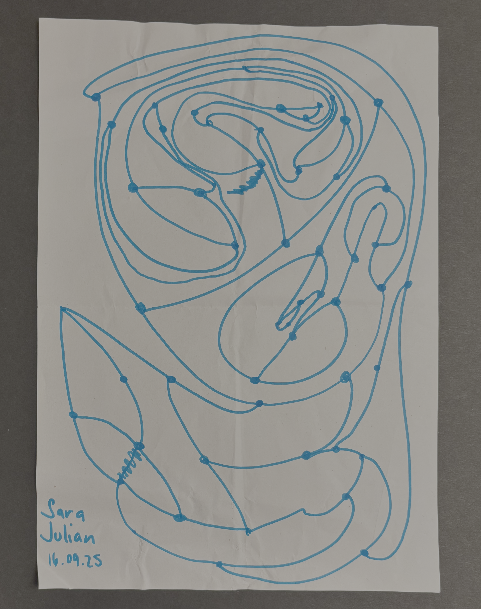
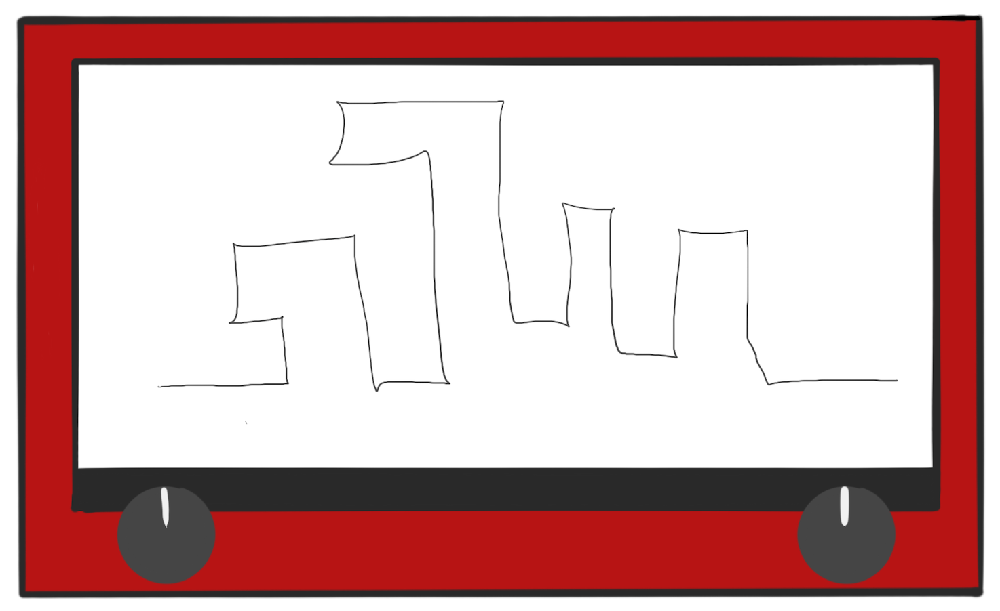
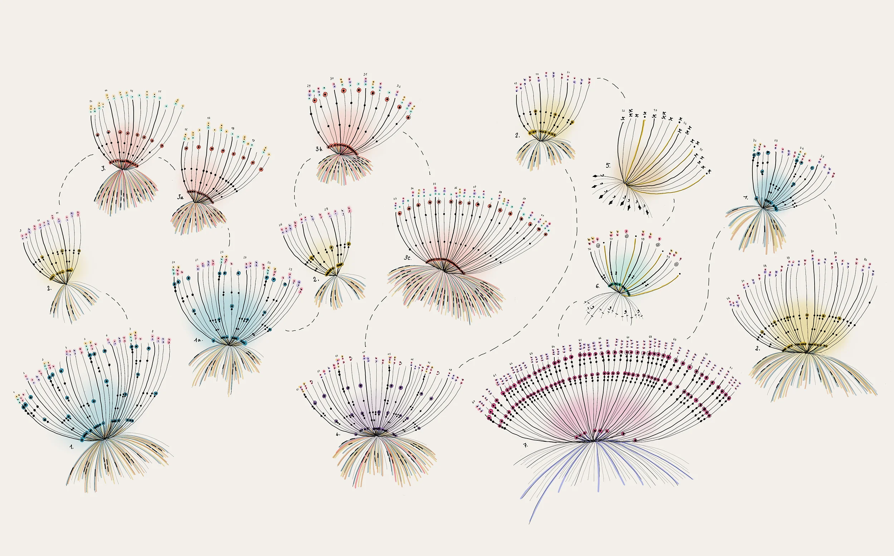

# Module Journal - Generative Computer Graphics

Coming from a background in carpentry, where my job description was basically "build it with your bare hands," using code as a creative tool has challenged me in ways I didn't see coming. This journal is a space for me to document the whole journey—the mistakes, the "aha!" moments, the total failures, and the wins. It’s a look at how my creative process is shifting from the analog world to an algorithmic one.

## Lesson 01 - Introduction & Foundations

In our first lecture, we dove into Generative Computer Graphics by playing a game called Sprouts. We started with a few random dots on paper, then took turns connecting them with lines and adding a new dot in the middle of every connection. We kept going until we were totally stuck. You can see our result below.



Honestly, we might have messed up the rules a bit, but we ended up with this random sketch that started as dots and finished looking like... a peach? A cockatoo? We aren't really sure, but we had a blast making it.

It reminded me of something Jared Tarbell said: "When you write a program, it’s going to be executed the same way every single time. So if you define a system like this where things can happen at random, as the creator, you can be surprised by your own program, which is really great."

That’s exactly why I picked one of his pieces to feature here; it's that element of randomness that makes the visuals feel unique.


I’ve always been fascinated by art that begins with one simple piece and, through nothing but repetition and a few rules, grows into something incredibly complex and complete.
  
## Lesson 02 - Grids & Iterative Patterns - Structured generative systems

My first attempt was inspired by a chessboard, using a simple function to build a grid of 8 columns and 8 rows. This served as the foundation for the logic I’d use later on.

 <iframe src="https://editor.p5js.org/trisaratops2.0/full/gHh0xZ56N" width="100%" height="450" frameborder="no"></iframe> 

The code calculates a `cellSize` by dividing the workspace into 8 columns and 8 rows. Using "nested loops" (a loop inside a loop), it systematically moves across every single "plot" on the grid, just like you’d mark out a piece of timber for repeatable cuts.

The line `if((i + j) % 2 == 0)` acts as a filter. It uses a bit of math to check if a cell is "even" or "odd." This ensures the code only draws on every other square, creating that alternating checkerboard pattern automatically rather than you having to pick each spot by hand.

This is a vital concept in creative coding.
- `push()`saves the current state of the canvas.
- `translate()` and `rotate()` move the "tools" to the center of a specific square.
- `pop()`resets everything back to the original corner. It’s exactly like using a jig in woodworking: you set it up to do one specific task in one specific spot, then remove it so you can move on to the next piece without your previous measurements interfering.

Instead of a static image, the code uses`frameCount` and `angle`.

- `frameCount` acts like a clock that never stops, causing the lines to spin.
- Adding `(i + j)` to the angle ensures that not every line spins at the exact same time. This creates a "staggered" or wave-like motion across the grid, adding that layer of complexity you mentioned admiring in Jared Tarbell’s work.

Building on what I learned in the first lesson, the next sketch takes the idea of a simple grid and makes it feel alive. It’s less about a static image and more about creating a "system" that moves on its own.

 <iframe src="https://editor.p5js.org/trisaratops2.0/full/yL7A0Io8S" width="100%" height="450" frameborder="no"></iframe> 

Just like the first experiment, this starts with a 10x10 grid. The code calculates a`centerX` and `centerY` for every single cell. This is important because it gives each square its own "anchor point." By defining these centers first, I can move, spin, or scale each square individually without them drifting out of their lane. It keeps the chaos organized.

Instead of just drawing squares, I’m using a `sin()` wave combined with the`frameCount` to control their size.
- The Scale: The `map()` function translates that mathematical wave into a `scaleFactor`, making the squares grow and shrink between 80% and 120% of their original size.
- The Offset: By adding `(x + y)` to the math, the squares don't pulse all at once. It creates a ripple effect that travels diagonally across the screen. It’s a perfect example of how adding one tiny variable to a simple rule can make a rigid grid feel organic and fluid.


After experimenting with rotating lines and pulsing squares, I wanted to combine the two ideas into turning tiles. In the process, I stumbled onto something pretty interesting.

 <iframe src="https://editor.p5js.org/trisaratops2.0/full/VInFjYFkg" width="100%" height="450" frameborder="no"></iframe> 

It’s hard to miss that the tiles are turning at different speeds. This happened because of how I set up the rotation math:

`let angle = frameCount * 0.01 * (x + y);`

Because the value of `x + y` is different for every single tile, the speed changes depending on where the tile is located. The tiles in the top-left rotate slowly, while the ones in the bottom-right spin much faster. This was one of those great moments where an unexpected result—basically a "mistake"—led to a completely new idea.

In the first canvas, I mostly played around with shapes and different ways to make things turn. In the second version, I experimented with color. It’s fascinating how such a small change in color can completely shift the mood of the piece. While the first one feels more mechanical, the second one feels like a floating simulation.

 <iframe src="https://editor.p5js.org/trisaratops2.0/full/4rfxuTqXl" width="100%" height="450" frameborder="no"></iframe> 

Since the `draw()` function refreshes about 60 times per second, the sketch is constantly unfolding. I noticed there’s a specific moment where all the tiles seem to align and turn together—it almost looks like a wave catching the sun or a mirror reflecting light, even though the colors aren't actually changing. It’s that element of surprise in the code that Jared Tarbell talked about.

## Lesson 03 - Clock / Time - Generative representation of time

### Clock

**How does your clock represent time differently from a real one?**

Unlike a normal clock with fixed hands moving around a face, this design uses colored arcs that grow and shrink over time. Instead of hands rotating, each ring fills up as seconds, minutes, and hours pass — so time feels like expanding waves rather than ticking motion. The pulsing center and soft transitions make it feel alive and continuous instead of mechanical.

**What does cyclical vs linear mean in your design?**

The design is cyclical because time loops visually — when seconds, minutes, or hours reset, their arcs start over smoothly, showing the repeating rhythm of time. There’s no straight path or endpoint. A linear design would show time as a timeline or progress bar moving in one direction. Here, everything circles back, symbolizing time as an ongoing cycle rather than a straight line.


<iframe src="https://editor.p5js.org/trisaratops2.0/full/Acucskcub" width="100%" height="450" frameborder="no"></iframe> 


This code uses the current computer time to draw animated, circular arcs that represent hours, minutes, and seconds.

- setup() makes a pink canvas and sets drawing modes (center alignment, degrees for angles).
- draw() runs every frame, updates the clock, and redraws everything.
  - It gets the current hour, minute, and second using p5.js time functions.
  - The translate(width/2, height/2) moves the origin to the canvas center.
  - Then three concentric arcs show time progress:
    - Outer arc → seconds (thin red line)
    - Middle arc → minutes (blue line)
    - Inner arc → hours (greenish line)
  - The arcs sweep clockwise using map() to convert time values to angles.
  - A small dark pulsing circle in the center represents milliseconds (beats once per second).
  - Digital time is displayed below the arcs in white text with AM/PM formatting.
  - Below that, the date (day/month/year) is shown subtly.
- mousePressed() saves the canvas as a PNG snapshot when you click.

## Lesson 04 - Drawing Machines - Generative systems as drawing tools

### Circle-Drawing tool

This sketch makes a simple generative circle-drawing tool. Every time you click, it drops a randomly sized, randomly colored circle at the mouse position.


<iframe src="https://editor.p5js.org/trisaratops2.0/full/yo2mJqUoO" width="100%" height="450" frameborder="no"></iframe> 

**How it works:**
- *circles* stores all created circles as *objects {x, y, r, color}*.
- *DEFAULT_RADIUS* is a base size that gets scaled randomly when you click.
- *setup()* makes a white canvas, turns off strokes so circles look clean.
- *draw()* loops through the *circles* array each frame and draws every one — that’s why older circles stay visible.
  - *mousePressed()* adds a new circle with:
  - random radius (20–120% of default)
  - random color with slight transparency (so overlaps blend nicely)
  - position where you clicked
    
**Summary:**
Each click adds a new circle, building up a layered field of colors — a simple interactive generative composition where randomness and repetition create the pattern.

### Etch A Sketch

I can't really say why or how, but while developing the circle drawing tool, I was reminded of another drawing tool. I couldn't remember what it was called, just the feeling of using it. I drew a quick sketch in Procreate, hoping someone would recognize it.



Finally, someone did: it was an Etch A Sketch. The toy was invented in the late 1950s by a French electrician. The idea came to him by watching pencil strokes being transferred through plastic sheets on a factory wall. Inside the glass screen is a thin layer of aluminum powder. When the knobs are turned, a hidden pointer (pen) moves across the surface and scratches away the powder. This process leaves dark lines where the powder has been removed.

 <iframe src="https://editor.p5js.org/trisaratops2.0/full/-WTDxlDWW" width="100%" height="600" frameborder="no"></iframe> 

This sketch is an Etch A Sketch–inspired drawing tool built with p5.js. It uses an offscreen buffer as the “screen,” which allows the etched lines to remain while the main canvas continuously redraws the frame and interface elements. The drawing can be controlled either by interacting with the knobs using the mouse, or through the keyboard: W and S move the stylus up and down, while A and D move it left and right.

**Offscreen Drawing Buffer**

`let buffer; `

The buffer functions as the Etch A Sketch screen. Because all drawing happens there, the frame and controls can be redrawn every frame without affecting the marks that have already been made. This separation helps the drawing behave more like a physical surface than a typical digital canvas.

**Stylus State**

`let stylus; `

`let prevStylus; `

The stylus represents the current position of the hidden drawing mechanism. It is not a visible pen, but an abstract point that moves across the buffer. Each frame, the previous position is stored, a new position is calculated, and a line is drawn between the two. This produces continuous strokes rather than discrete points, reinforcing the feeling of a mechanical plotting process.

**Button object: Rotary encoder as control signal**

`function Knob(x, y, r, orientation) `

Each knob is defined as a small object with a position, a radius, a rotation angle, and a grab state to track interaction. The knobs do not move the stylus directly. Instead, changes in their rotation are interpreted as movement signals, which are later translated into drawing.

**Visual Representation**

```
Knob.prototype.draw = function() {
  rotate(this.angle);
  ellipse(0, 0, this.r*2);
  line(0, -this.r*0.5, 0, -this.r*0.9);
};
```
A simple line indicator shows the current orientation of each knob. This makes the rotation legible without the need for numerical values or additional interface elements.

**Interaction Logic**

`Knob.prototype.hitTest = function(mx, my) `

The knobs can be grabbed using distance-based hit detection. Once grabbed, their angle is updated using:

`atan2(mouseY - knob.y, mouseX - knob.x) `

This converts circular mouse movement into rotation, preserving an intuitive and physically familiar interaction.

**Translating Rotation into Drawing**

The most important conceptual step takes place in `applyKnobMovement()`:

`let dA_left  = leftKnob.angle  - lastAngles.left; `

`let dA_right = rightKnob.angle - lastAngles.right;`

Instead of using absolute angles, the sketch measures how much each knob has rotated since the last frame. These angular changes are then converted into linear movement:

`let dx = dA_left  * (speedFactor * 60); `

`let dy = dA_right * (speedFactor * 60); `

This approach avoids sudden jumps, encourages slow and continuous interaction, and introduces a sense of inertia similar to physical mechanisms. The stylus is constrained to the boundaries of the buffer, preserving the edges of the drawing surface.

**Drawing as Accumulation**

`buffer.line(prevStylus.x, prevStylus.y, stylus.x, stylus.y); `

Each frame leaves behind a permanent mark. There is no undo, and no way to correct a line once it has been drawn. This creates a subtle pressure toward patience and intentionality, echoing the constraints of analog drawing tools.

**Frame and Interface Design**

The red frame surrounding the drawing area is purely graphical, but it plays an important role in how the sketch is perceived. It frames the interaction as an object or device rather than an open canvas:

`rect(0, 0, width, height, 28); `

`text('ETCH A SKETCH', width/2, 28); `

This reinforces the metaphor and invites a more playful, exploratory approach to drawing.

**Reflection**

This sketch shows how relatively simple relationships—angular change, linear mapping, and constraint—can produce rich generative behavior when paired with a strong interaction metaphor. The drawing emerges over time through use, rather than through direct control, positioning the system somewhere between a drawing tool and a generative machine.

## Lesson 06 - Faces / Parametric Generators - Parametric design through faces

### Faces

This week we learend how to write a program that generates parametric faces and learned about the difference between **Continuous parameters** (smooth transitions) and **Discrete parameters** (distinct options). 

 <iframe src="https://editor.p5js.org/trisaratops2.0/full/67_o7XVZZ" width="100%" height="450" frameborder="no"></iframe> 

### Reflection

- How is your machine “expressive” rather than “functional”?
- What limitations or constraints shaped your outcome?

## Lesson 07 - Pixels - Pixels as material + Advanced pixel transformations

### Pixels

What if pixels had different shapes?
What if they were arranged differently than in a grid?
What if they could be represented in a completely different form?
How can pixel data (color, brightness, position) drive visual generation?

For the pixel project I got the idea from an influencer on instagram. First step is using a picture of someone you would hang on your wall.


Third and fourth step is rearange the pixels.


For the digital version I wanted to change the width of the image but at the begining I had the wrong idea of doing so. I was deviding the image through 4 (marked orange), or so i thought. Actually i was only dividing the canvas. So the canvas was getting smaller but not the image itself that's why in the end you can see the top right corner the grey background of the tiger.


In the second attempt i made the canvas smaller and to guarantee that the image always fits the canva we add this part of code: image(img, 0, 0, width, height);


After that I wanted 

# Project Idea

## Mind Garden

**Concept**

An interactive visualization of emotions. Users type one word describing how they feel, and the system grows a visual form based on its semantic meaning — e.g., “calm” creates smooth blue waves, “angry” triggers red spikes and chaotic movement.

**Interaction**
- Text input = seed word
- Algorithm translates sentiment → color, form, and motion rules
- Over time, the canvas becomes a garden of emotions from the users

**Why?**

It’s interactive and personal — visualizing emotions is always fascinating, as the outcomes can be surprising and unique each time. I can also imagine this being a fun and creative tool for psychologists to include on their websites, allowing visitors to express their feelings and receive engaging visual feedback.

(Sketch of my core idea)

## First Prototype

To help me visualize in what i wanna go I started with a simple canvas where i can put in emotions, depending on the word a different "plant" is growing in the canvas.

 <iframe src="https://editor.p5js.org/trisaratops2.0/full/6MoSRjm5T" width="100%" height="450" frameborder="no"></iframe> 

### Explanations of key codes

**let plants = [];**
This array stores all the emotion-plants the user creates.
Each new word becomes a new instance of the EmotionPlant class.

**button.mousePressed(() => addEmotion(input.value()));**
Links the button to the emotion-creation system.
When the user clicks Grow, the word they typed is processed and turned into a plant.

**getMoodScore(word)**
This function classifies the user’s emotion word into a mood score:
1 → positive
0.5 → neutral
0 → negative
This single score determines color, shape, and growth behavior.

**plants.push(new EmotionPlant(word, moodScore));**
Creates a new plant object and adds it to the world.
Every plant is independent and grows each animation frame.

**class EmotionPlant { ... }**
Encapsulates all the logic for representing emotions visually.
Each plant stores:
where it appears
its color
its growth size
its shape behavior

**getColor()**
Maps emotion intensity to color:
red → negative
yellow → neutral
blue → positive
Color becomes a visual cue for emotional tone.

**grow()**
Runs every frame and determines:
how the plant is drawn (chaotic / balanced / smooth)
how fast and in what direction it grows
This makes the sketch feel alive — each emotion keeps evolving on its own.

## Second Prototype

With these adjustments current state looks like this:

 <iframe src="https://editor.p5js.org/trisaratops2.0/full/qzwCd8oHs" width="100%" height="450" frameborder="no"></iframe> 

### Improvements on the Emotinal Logic

**Weigted emotional dictionary**
Instead of classifying words as only positive/neutral/negative, i'm giving them each a score between 0-1.

```js
let emotionMap = {
  happy: 0.9,
  calm: 0.7,
  bored: 0.3,
  anxious: 0.1,
  angry: 0.05
};
```

**Partial matching**
Let's words like "happier", "angriness", "stressfull" still be recognized:

`if (word.includes("stress")) return 0.1;`

`if (word.includes("happy")) return 0.9;`

**Intensifiers**
Giving Adjectives more value and letting them affecting the plant:

`if (word.includes("very")) score += 0.1;`

`if (word.includes("slightly")) score -= 0.1;`

## Prototype 3

 <iframe src="https://editor.p5js.org/trisaratops2.0/full/lzCFzuMod" width="100%" height="450" frameborder="no"></iframe> 

### Improvments of Visuals

Since a human beings emotion can't just be pushed into 3 catories and a Matthew reminded me of the movie inside out, i wanted to implement that into the project to improve the visual.

 <iframe src="https://editor.p5js.org/trisaratops2.0/full/XbXVN_bI6" width="100%" height="450" frameborder="no"></iframe> 

# Shift of Concept

My initial concept was an Emotional Garden—an interactive visualization where a single emotion word (e.g., "calm," "angry") seeds a personal, evolving, abstract form. The core fascination was the translation of subjective inner states into objective visual output.

However, I recognized an opportunity to apply this generative visualization not just to personal emotion, but to constructive public engagement.

The Shift: I'm transitioning from a purely expressive tool for personal reflection to an analytical tool for constructive service feedback. Instead of asking "How do you feel?" I'm asking "How did this service/feature make you feel, and why?"

So the Core Concept of getting a visual feedback stays the same, simply its purpose has changed.

## The Generative Feedback Machine

This interactive system is designed for service websites to gather more nuanced, actionable feedback than a simple star rating or open text box typically provides.

Input: Users interact with a feedback prompt after using a service (e.g., "How was the checkout process?"). They are presented with a constrained choice of emotional tones ("Frustrated," "Efficient," "Confused," "Delighted," etc.) and a small text input for elaboration.

Generative Visualization: The system combines the chosen emotional tone and the semantic content of the text input to generate a unique, abstract 3D or 2D p5.js form.

Emotion (Color/Motion): "Frustrated" might trigger jagged, rapid, red/orange forms. "Delighted" might generate smooth, slow, expanding yellow/gold spheres.

Text Semantics (Form/Complexity): Analyzing the text ("The delivery was late" vs. "The design was sleek") refines the form. The word "late" might introduce a dragging, distorted texture, while "sleek" might sharpen the edges and increase smoothness.

Visualization as Data: Each piece of feedback is instantly added to a collective, evolving visualization (a "Feedback Cloud" or "Service Aura").

The service provider can view this collective visualization, immediately identifying dominant tones (a massive "Frustrated" spike) and drilling down into the specific forms/text associated with it to understand why the service feels that way.

## Giorgia Lupi (Data Humanism)



My visualization is grounded in the philosophy of Data Humanism, championed by designers like Giorgia Lupi. Her work advocates for visualizing data not as cold, objective facts, but as nuanced, subjective human experiences. By translating collective user sentiment (Frustrated, Delighted, etc.) into a growing, abstract sculptural form, we are providing a humanistic, emotional summary of the service experience, moving beyond the sterile efficiency of a standard feedback form.

## Iterations

 (sketch of my core idea)

###  01

In the first prototype I was trying visualize that in a simple way.

 <iframe src="https://editor.p5js.org/trisaratops2.0/full/iqbApEpX_" width="100%" height="450" frameborder="no"></iframe> 
